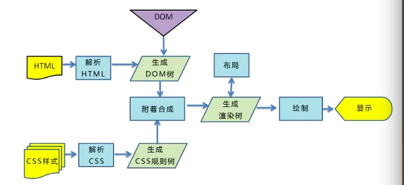

# 浏览器渲染原理
了解浏览器渲染页面的过程，首先得知道一个名词：关键渲染路径。
关键渲染路径是指浏览器从最初接收请求来的HTML、CSS、javascript等资源，然后解析、构建树、渲染布局、绘制，最后呈现给用户能看到的界面这整个过程。
## 浏览器渲染的过程主要包括以下五步：
* 浏览器将获取的HTML文档解析成DOM树。
* 处理CSS标记，构成层叠样式表模型CSSOM(CSS Object Model)。
* 将DOM和CSSOM合并为渲染树(rendering tree)，代表一系列将被渲染的对象。
* 渲染树的每个元素包含的内容都是计算过的，它被称之为布局layout。浏览器使用一种流式处理的方法，只需要一次绘制操作就可以布局所有的元素。
* 将渲染树的各个节点绘制到屏幕上，这一步被称为绘制painting。
  
  

## 具体流程：
* 构建DOM树
当浏览器接收到服务器响应来的HTML文档后，会遍历文档节点，生成DOM树。
* 构建CSSOM规则树
浏览器解析CSS文件并生成CSSOM，每个CSS文件都被分析成一个StyleSheet对象，每个对象都包含CSS规则。CSS规则对象包含对应于CSS语法的选择器和声明对象以及其他对象。
* 构建渲染树（Render Tree）
通过DOM树和CSS规则树，浏览器就可以通过它两构建渲染树了。浏览器会先从DOM树的根节点开始遍历每个可见节点，然后对每个可见节点找到适配的CSS样式规则并应用。
渲染树生成后，还是没有办法渲染到屏幕上，渲染到屏幕需要得到各个节点的位置信息，这就需要布局（Layout）的处理了。
* 渲染树布局(layout of the render tree)
布局阶段会从渲染树的根节点开始遍历，由于渲染树的每个节点都是一个Render Object对象，包含宽高，位置，背景色等样式信息。所以浏览器就可以通过这些样式信息来确定每个节点对象在页面上的确切大小和位置，布局阶段的输出就是我们常说的盒子模型，它会精确地捕获每个元素在屏幕内的确切位置与大小。
* 渲染树绘制（Painting the render tree）
在绘制阶段，浏览器会遍历渲染树，调用渲染器的paint()方法在屏幕上显示其内容。

# 制作动画的两种方式
## transition
* 语法：
transition: property duration timing-function delay;

property:填写需要变化的css属性如：width,line-height,font-size,color等;
duration:完成过渡效果需要的时间（2s 或者2000ms);
timing-function:完成效果的速度曲线（linear,ease,ease-in,ease-out等等);
timing-delay:动画效果的延迟触发时间（2s 或者2000ms).

## animation
* 语法：
animation: animation: name duration timing-function delay iteration-count direction;

name:keyframe的名称，也就是定义了关键帧的动画的名称,这个名称用来区别不同的动画。
duration:完成动画所需要的时间（2s 或者 2000ms）
timing-function:完成动画的速度曲线
delay：动画开始之前的延迟
iteration-count：动画播放次数
direction：是否轮流反向播放动画（normal:正常顺序播放，alternate下一次反向播放）如果把动画设置为只播放一次，则该属性没有效果。
